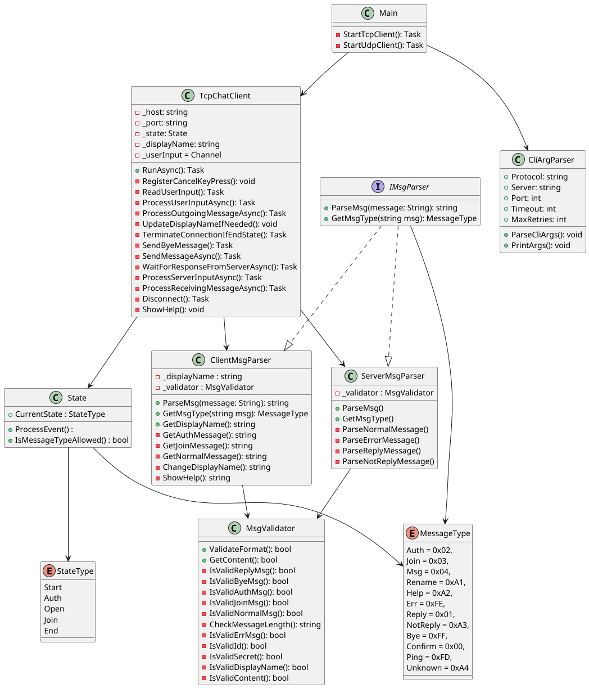

# IPK Project 2: Client for a chat server using the IPK25-CHAT protocol

Author: **Boris Hatala** (xhatal02) \
Date: 02-04-2025

# TODO: semaphores

## Table of Contents
- [Introduction](#introduction)
- [Usage](#usage)
  - [Prerequisites](#prerequisites)
  - [Supported command line arguments](#supported-command-line-arguments)
- [Design & Implementation](#design)
  - [TCP Variant](#tcp-variant)
    - [TcpChatClient](#tcpchatclient)
    - [ClientMsgParser](#clientmsgparser)
    - [ServerMsgParser](#servermsgparser)
    - [State](#state)
    - [CliArgParser](#cliargparser)
- [Testing](#testing)
- [Bibliography](#bibliography)

## Introduction

The goal of this project is to create a command line client for a chat server using the IPK25-CHAT protocol. 
The client should be able to connect to the server, send and receive messages using TCP or UDP transport protocol.
The project is implemented in C# and uses the .NET Framework version 9.0.

## Usage

### Prerequisites
- .NET Framework 9.0 or higher

Root directory of the project:
```
$ make
``` 
```
$ ./ipk25chat-client -t [tcp / udp] -s [IP address / hostname] [options]
```

### Supported command line arguments
**REQUIRED**
- `-t` - transport protocol used for connection (tcp / udp) 
- `-s` - ip address or hostname of the server

**OPTIONAL**
- `-p` - port number (default: 4567)
- `-d` - UDP confirmation timeout (in milliseconds, default: 250)
- `-r` - maximum of UDP retransmissions (default: 3)
- `-h` - help (displays usage information)

## Design & Implementation
## TCP Variant


### TcpChatClient

This class is responsible for establishing a TCP connection to the server and asynchronously receiving messages
from the server and handling user input. \
**ReadUserInput()** method reads input from the console and stores data in the buffer (Channel).
Client simultaneously processes only a single user input, another one is processed once the last 
action has been successfully finished (Receiving `REPLY` message from the server when authorizing 
or in case of local `/rename` command successfully processing by the client). \
Response from the server must be received in the span of 5 seconds, otherwise the client closes the connection. \
When `EOF` is detected, the client first processes every message in the buffer and then gracefully closes the connection. \
**ProcessOutgoingMessageAsync()** handles sending messages to the server in required format. \
First, we get the message type to check if this message type is allowed in the current state of the client
(e.g., the client cannot send a regular message before authorizing). \
Second, we format user input to the required format using **ClientMsgParser** and send it to the server. \
Lastly, once the message is sent we wait for response from the server in case of `AUTH` or 
`JOIN` type messages. Based on the nature of the response, further actions are taken. \
Client always checks for `SIGINT` (CTRL+C) and in that case sends `BYE` message to the server 
and gracefully closes the connection.

### ClientMsgParser
This class implements **IMsgParser** interface and is responsible for parsing user input and formatting it to the required format according to `IPK25-CHAT` protocol. \
Before returning the result to the **TcpChatClient** class, it checks if the message complies
with `IPK25-CHAT` message grammar. In case of an invalid message, **TODO** .

### ServerMsgParser
This class implements **IMsgParser** interface and is responsible for parsing messages received from the server to the required format
that can be displayed in the terminal to the user. \
Before parsing it checks if the message complies with `IPK25-CHAT` message grammar. In case of an invalid message,
`ERR` message is sent to the server, if possible, and connection is closed.

### State

This class is used to track the current state of the client according to the `IPK25-CHAT` protocol. \
**ProcessEvent()** method accepts `MessageType` argument and changes the state of the client based on the current state and the message type. \
**IsMessageTypeAllowed()** method is used to determine if the client can send a message of a certain type based on the current state.

### CliArgParser
This class is responsible for parsing command line arguments and storing them for further use.

## Testing

### Using `netcat` to simulate the server
#### Motivation
The goal of this testing method is to simulate the server and test the client in a controlled environment while
being able to see the messages sent and received by the client in the `netcat`.

#### 1. Basic functionality

#### 2. Receiving a malformed message from the server

#### 3. Sending a malformed message to the server

#### 4. Sending a message to the server while being in the wrong state

#### 5. Receiving an error message from the server

#### 6. Not receiving a response from the server in 5 seconds

#### 7. Receiving EOF from the user

#### 8. Lost connection to the server

## Bibliography
1. RFC 9293, Transmission Control Protocol (TCP) https://www.ietf.org/rfc/rfc9293.html
2. RFC 1350, The TFTP Protocol (Revision 2) https://datatracker.ietf.org/doc/html/rfc1350
