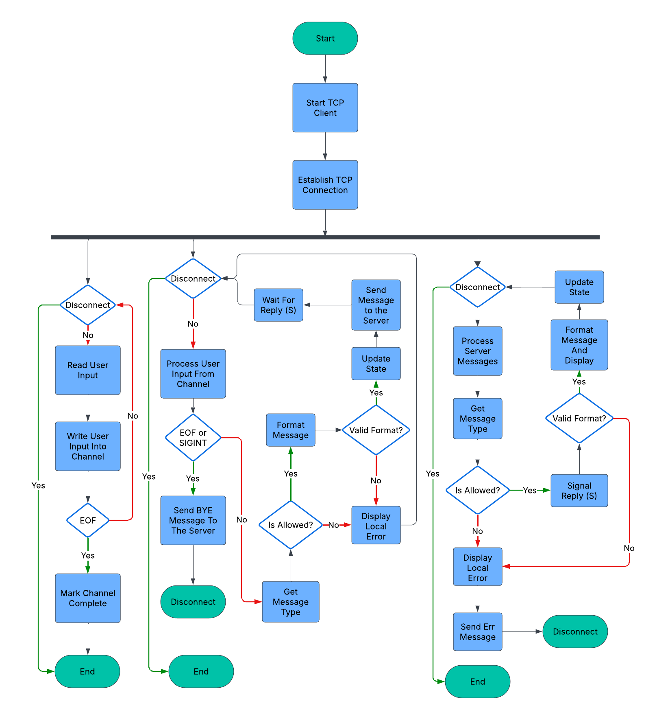

# IPK Project 2: Client for a chat server using the IPK25-CHAT protocol

Author: **Boris Hatala** (xhatal02) \
Date: 02-04-2025

## Table of Contents
- [Introduction](#introduction)
- [Usage](#usage)
  - [Prerequisites](#prerequisites)
  - [Supported command line arguments](#supported-command-line-arguments)
- [Design & Implementation](#design)
  - [TCP Variant](#tcp-variant)
    - [TcpChatClient](#tcpchatclient)
    - [ClientMsgParser](#clientmsgparser)
    - [ServerMsgParser](#servermsgparser)
    - [State](#state)
    - [CliArgParser](#cliargparser)
- [Testing](#testing)
- [Bibliography](#bibliography)

## Introduction

The goal of this project is to create a command line client for a chat server using the IPK25-CHAT protocol. 
The client should be able to connect to the server, send and receive messages using TCP or UDP transport protocol.
The project is implemented in C# and uses the .NET Framework version 9.0.

## Usage

### Prerequisites
- .NET Framework 9.0 or higher

Root directory of the project:
```
$ make
``` 
```
$ ./ipk25chat-client -t [tcp / udp] -s [IP address / hostname] [options]
```

### Supported command line arguments
**REQUIRED**
- `-t` - transport protocol used for connection (tcp / udp) 
- `-s` - ip address or hostname of the server

**OPTIONAL**
- `-p` - port number (default: 4567)
- `-d` - UDP confirmation timeout (in milliseconds, default: 250)
- `-r` - maximum of UDP retransmissions (default: 3)
- `-h` - help (displays usage information)

## Design & Implementation
## TCP Variant

### Class Diagram


### TcpChatClient

This class is responsible for establishing a TCP connection to the server and asynchronously receiving messages
from the server and handling user input. \
**ReadUserInput()** method reads input from the console and stores data in the buffer (Channel).
Client simultaneously processes only a single user input, another one is processed once the last 
action has been successfully finished (Receiving `REPLY` message from the server when authorizing 
or in case of local `/rename` command successfully processing by the client). \
Response from the server must be received in the span of 5 seconds, otherwise the client closes the connection. \
When `EOF` is detected, the client first processes every message in the buffer and then gracefully closes the connection. \
**ProcessOutgoingMessageAsync()** handles sending messages to the server in required format. \
First, we get the message type to check if this message type is allowed in the current state of the client
(e.g., the client cannot send a regular message before authorizing). \
Second, we format user input to the required format using **ClientMsgParser** and send it to the server. \
Lastly, once the message is sent we wait for response from the server in case of `AUTH` or 
`JOIN` type messages. Based on the nature of the response, further actions are taken. \
Client always checks for `SIGINT` (CTRL+C) and in that case sends `BYE` message to the server 
and gracefully closes the connection.

### ClientMsgParser
This class implements **IMsgParser** interface and is responsible for parsing user input and formatting it to the required format according to `IPK25-CHAT` protocol. \
Before returning the result to the **TcpChatClient** class, it checks if the message complies
with `IPK25-CHAT` message grammar. In case of an invalid message, **TODO** .

### ServerMsgParser
This class implements **IMsgParser** interface and is responsible for parsing messages received from the server to the required format
that can be displayed in the terminal to the user. \
Before parsing it checks if the message complies with `IPK25-CHAT` message grammar. In case of an invalid message,
`ERR` message is sent to the server, if possible, and connection is closed.

### State

This class is used to track the current state of the client according to the `IPK25-CHAT` protocol. \
**ProcessEvent()** method accepts `MessageType` argument and changes the state of the client based on the current state and the message type. \
**IsMessageTypeAllowed()** method is used to determine if the client can send a message of a certain type based on the current state.

### CliArgParser
This class is responsible for parsing command line arguments and storing them for further use.

### Flow Chart
This flow chart illustrates the flow of the program and the interactions between the processes.

**Note:** The program uses `cancelation tokens` so disconnection and termination of the program may happen
any time, not only in the `Disconnect` option. For better readability the flow chart is in this case simplified. 


After the client successfully connects to the server, it starts reading user input into a `Channel`.

Another thread is started to process data from this channel, so format it and check the validity of its content.
If the message is valid, the state of the client is changed or stays the same based on the message type, and the message is sent to the server.

Another thread processes messages from the server, checks their validity, formats them and displays 
them to the user. If the message is valid, the state of the client is changed or stays the same based on the message type.

The client gracefully closes connection and terminates upon receiving `SIGINT` or `EOF`.
All the messages beforehand are processed.
Upon receiving an error message from the server, it tries to send an error message and terminates.

## Testing

### Using `netcat` to simulate the server
#### Motivation
The goal of this testing method is to simulate the server and test the client in a controlled environment while
being able to see the messages sent and received by the client in the `netcat`.

#### 1. Basic functionality
**Motivation** of this test is to check if the client can successfully 
authenticate, join a channel, send messages to the server, change its 
display name and receive messages from the server.

**Input file:** 01.txt

**Input file:** 01Reply.txt

<div style="display: grid; grid-template-columns: 1fr 1fr; gap: 20px;align-items: start;">

<div>

```
/auth username secret Client
/help
Hello world
/join TestChannel
Hello world to the TestChannel
/rename ClientNewName
Hello world, I have just changed my name!
```


```
REPLY OK IS AUTH username AS Client USING secret
MSG FROM User IS Hello client
REPLY OK IS JOIN TestChannel AS Client
```

</div>
<div>

```
$ ./ipk25chat-client -t tcp -s localhost < Tests/BasicFunctionality.txt 
Action Success: AUTH username AS Client USING secret
Available commands:
/auth <id> <secret> <displayName> - Authenticate
/join <channelId> - Join a channel
/rename <newDisplayName> - Change name
/help - Show help
User: Hello client
Action Success: JOIN TestChannel AS Client
```

```
$ tail -f BasicFunctionalityReply.txt | nc -l -4 -C -p 4567
AUTH username AS Client USING secret
MSG FROM Client IS Hello world
JOIN TestChannel AS Client
MSG FROM Client IS Hello world to TestChannel
MSG FROM ClientNewName IS I changed my name!
BYE FROM ClientNewName
```
</div> </div>

#### 2. Receiving a malformed message from the server
**Motivation** of this test is to check if the client can detect a 
malformed message received from the server, display a local error and 
send an error message to the server.

**Input file:** 02.txt

**Input file:** 02Reply.txt

<div style="display: grid; grid-template-columns: 1fr 1fr; gap: 20px;">

<div>

```
/auth username secret Client
/join TestChannel
```


```
REPLY OK IS AUTH username AS Client USING secret
MSG FROM User2 IS Hello world
Malformed message
REPLY OK IS JOIN TestChannel AS Client
```

</div>
<div>

```
$ ./ipk25chat-client -t tcp -s localhost < Tests/02.txt
Action Success: AUTH username AS Client USING secret
User2: Hello world
ERROR: Malformed message
```

```
$ tail -f 02Reply.txt | nc -l -4 -C -p 4567
AUTH username AS Client USING secret
JOIN TestChannel AS Client
```
</div> </div>

#### 3. Sending a malformed message to the server
**Motivation** of this test is to check if the client can detect a malformed message and display a local
error message.

**Input file:** 03.txt

**Input file:** 03Reply.txt


<div style="display: grid; grid-template-columns: 1fr 1fr; gap: 20px;">

<div>


```
/auth username secret Client
/join TestChannel....
Hey girl
Hey man
Hey man
/join TestChannel
What's up
```


```
REPLY OK IS AUTH username AS Client USING secret
MSG FROM User IS Hello world
MSG FROM User5 IS Hello world
MSG FROM User2 IS Hello world
MSG FROM User3 IS Hello world
REPLY OK IS JOIN TestChannel AS Client
```

</div>
<div>

```
$ ./ipk25chat-client -t tcp -s localhost < Tests/03.txt 
Action Success: AUTH username AS Client USING secret
ERROR: JOIN TestChannel.... AS Client
Action Success: JOIN TestChannel AS Client
```

```
$ nc -l -4 -C -p 4567
AUTH username AS Client USING secret
REPLY OK IS AUTH username AS Client USING secret
MSG FROM Client IS Hey girl
MSG FROM Client IS Hey man
MSG FROM Client IS Hey man
JOIN TestChannel AS Client
REPLY OK IS JOIN TestChannel AS Client
MSG FROM Client IS What's up
BYE FROM Client
```
</div> </div>


#### 4. Trying to send a message in a wrong state
**Motivation** of this test is to check if the client can detect that use is trying
to send a message type that is not possible in a specific state and display a local client error.

**Input file:** 04.txt

**Input file:** 04Reply.txt


<div style="display: grid; grid-template-columns: 1fr 1fr; gap: 20px; align-items: start;">

<div>

```
Hello world
/auth username secret Client
Hello world retry
```

```
REPLY OK IS AUTH username AS Client USING secret
MSG FROM User IS Hello man
```

</div>
<div>

```
$ ./ipk25chat-client -t tcp -s localhost < Tests/04.txt 
ERROR: This message type 'Msg' is not allowed in the current state 'Start'
Available commands:
/auth <id> <secret> <displayName> - Authenticate with the server
/join <channelId> - Join a channel
/rename <newDisplayName> - Change your display name
/help - Show this help message
Action Success: AUTH username AS Client USING secret
```

```
$ nc -l -4 -C -p 4567
AUTH username AS Client USING secret
REPLY OK IS AUTH username AS Client USING secret
MSG FROM Client IS Hello world retry
BYE FROM Client
```
</div> </div>

#### 5. Receiving an error message from the server
**Motivation** of this test is to check if the client upon receiving 
an error message from gracefully terminates the connection.

**Input file:** 05.txt

**Input file:** 05Reply.txt


<div style="display: grid; grid-template-columns: 1fr 1fr; gap: 20px;">

<div>

```
/auth username secret Client
```

```
ERROR FROM Server IS You have to disconnect
```

</div>
<div>

```
$ ./ipk25chat-client -t tcp -s localhost < Tests/05.txt 
ERROR: ERROR FROM Server IS You have to disconnect
```

```
$ nc -l -4 -C -p 4567
AUTH username AS Client USING secret
ERROR FROM Server IS You have to disconnect
ERR FROM Client IS ERROR FROM Server IS You have to disconnect
```
</div> </div>

#### 6. Not receiving a response from the server in 5 seconds
**Motivation** of this test is to check if the client closes the connection
after not receiving a response from the server in 5 seconds and sends an 
error message.

We take into account the startup and the establishment of the connection.

**Input file:** 05.txt


<div style="display: grid; grid-template-columns: 1fr 1fr; gap: 20px;">

<div>

```
/auth username secret Client
```

No reply from the server.

</div>
<div>

```
$ time ./ipk25chat-client -t tcp -s localhost < Tests/05.txt 
ERROR: Server response timeout

real    0m5.123s
user    0m0.107s
sys     0m0.033s
```

<br>

```
$ nc -l -4 -C -p 4567
AUTH username AS Client USING secret
ERR FROM Client IS 
```
</div> </div>

#### 7. Receiving SIGINT from the user
**Motivation** of this test is to check if the client gracefully 
closes the connection and sends a `BYE` message to the server when the user
presses `CTRL+C`.
```
./ipk25chat-client -t tcp -s localhost
/auth username secret Client
Action Success: AUTH username AS Client USING secret
```

```
nc -l -4 -C -k -p 4567
AUTH username AS Client USING secret
REPLY OK IS AUTH username AS Client USING secret
BYE FROM Client
```

#### 8. Receiving a negative reply from the server
**Motivation** of this test is to check if the client can handle a 
negative reply from the server, display a confirmation or failure message.

**Input file:** 08.txt

**Input file:** 08Reply.txt

<div style="display: grid; grid-template-columns: 1fr 1fr; gap: 20px;">

<div>

```
/auth username secret Client
/auth username secret2 Client
Hello world
/join TestChannel
/join TestChannel
What's up guys?
```

```
REPLY NOK IS AUTH username AS Client USING secret
REPLY OK IS AUTH username AS Client USING secret2
REPLY NOK IS JOIN TestChannel AS Client
REPLY OK IS JOIN TestChannel AS Client
```

</div>
<div>

```
$ ./ipk25chat-client -t tcp -s localhost < Tests/08.txt 
Action Failure: AUTH username AS Client USING secret
Action Success: AUTH username AS Client USING secret2
Action Failure: JOIN TestChannel AS Client
Action Success: JOIN TestChannel AS Client
```

```
$ nc -l -4 -C -p 4567
AUTH username AS Client USING secret
REPLY NOK IS AUTH username AS Client USING secret
AUTH username AS Client USING secret2
REPLY OK IS AUTH username AS Client USING secret2
MSG FROM Client IS Hello world
JOIN TestChannel AS Client
REPLY NOK IS JOIN TestChannel AS Client
JOIN TestChannel AS Client
REPLY OK IS JOIN TestChannel AS Client
MSG FROM Client IS What's up guys?
BYE FROM Client
```
</div> </div>

#### 9. Receiving a BYE message from the server

**Motivation** of this test is to check if the client closes the connection gracefully and
terminates upon receiving a `BYE` message from the server.

**Input file:** 09.txt

**Input file:** 09Reply.txt

<div style="display: grid; grid-template-columns: 1fr 1fr; gap: 20px;">

<div>

```
/auth username secret Client
/join TestChannel
```

```
REPLY OK IS AUTH username AS Client USING secret
BYE FROM Server
```

</div>
<div>

```
$ /ipk25chat-client -t tcp -s localhost < Tests/09.txt 
Action Success: AUTH username AS Client USING secret
```

```
$ nc -l -4 -C -p 4567
AUTH username AS Client USING secret
REPLY OK IS AUTH username AS Client USING secret
JOIN TestChannel AS Client
BYE FROM Server
BYE FROM Client
```
</div> </div>

#### 10. Message segmentation

**Motivation** of this test it to see if the client is able to handle segmented messages from the server.
A complete message is only if it ends with `\r\n` sequence.

#### 11. Exceeded message length

**Motivation** of this test is to check if the client can handle messages 
which content exceeded the maximum length of 60 000 characters and trims it.

**Input file:** 11.txt

**Input file:** 11Reply.txt


<div style="display: grid; grid-template-columns: 1fr 1fr; gap: 20px;">

<div>

```
/auth username secret Client
RY0cZP8qvLqjrzrc9j1jaHQVpF6bygyi9...7VpHNPFbYM41343235t4AAAAAAAAAAAAA
```

```
REPLY OK IS AUTH username AS Client USING secret
```

</div>
<div>

```
$ ./ipk25chat-client -t tcp -s localhost < Tests/11.txt 
Action Success: AUTH username AS Client USING secret
ERROR: Message is too long, max 60000 characters
```

```
$ nc -l -4 -C -p 4567
AUTH username AS Client USING secret
REPLY OK IS AUTH username AS Client USING secret
MSG FROM Client IS RY0cZP8qvLqjrzrc9j1jaHQVpF6bygyi9...7VpHNPFbYM4
BYE FROM Client
```
</div> </div>


## Bibliography
1. RFC 9293, Transmission Control Protocol (TCP) https://www.ietf.org/rfc/rfc9293.html
2. RFC 1350, The TFTP Protocol (Revision 2) https://datatracker.ietf.org/doc/html/rfc1350
